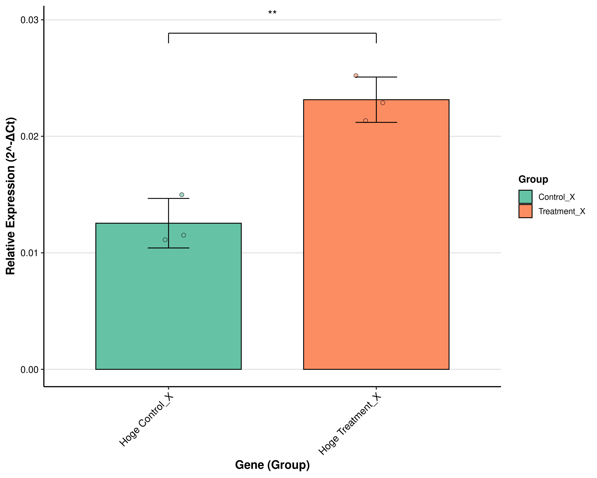
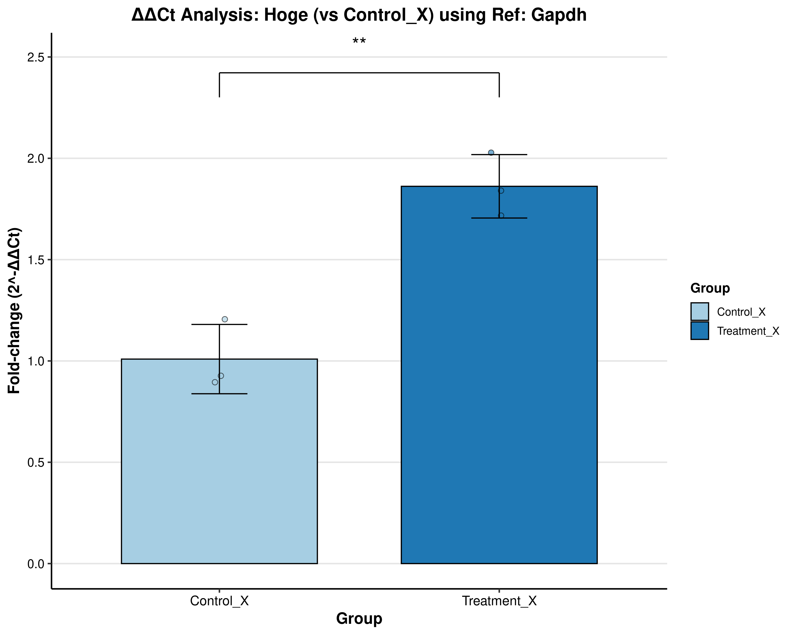

# Click-qPCR
Ultra-simple tool for interactive qPCR data analysis developed by R and Shiny.

[Read this document in Japanese (日本語版のユーザーガイドはこちら)](README_jp.md)

## Overview

Click-qPCR is a user-friendly Shiny web application designed for the straightforward analysis of quantitative PCR (qPCR) data. 

**This tool is readily accessible via a web browser at [https://kubo-azu.shinyapps.io/Click-qPCR/](https://kubo-azu.shinyapps.io/Click-qPCR/), requiring no local installation for end-users.** 

It allows users to upload their Ct (threshold cycle) values, perform ΔCt and ΔΔCt calculations, visualize results as bar plots with individual data points, and download both the statistical summaries and publication-quality plots. 

For users who prefer to run or modify the application locally, the source code is also available (see Installation and Usage section below).

This tool aims to simplify common qPCR data analysis workflows, making them more accessible to researchers without requiring extensive programming knowledge.

### Notice

This repository contains the source code for the Shiny app accompanying the preprint:

A Kubota, et al. *bioRxiv*. (2025). [https://doi.org/10.1101/2025.05.29.656779](https://doi.org/10.1101/2025.05.29.656779).

**Please cite this paper if you use this app or code in your research.**

## Features

* **Interactive Data Upload:** Easily upload your qPCR data in CSV format.
    * Download a template CSV file to guide data formatting.

* **Data Preview:** View the head of your uploaded data.

* **ΔCt Analysis:**
    * Select reference and target genes.
    * Choose control and treatment groups for comparison.
    * Calculates relative expression (2<sup>-ΔCt</sup>).
    * Performs Welch's t-test for statistical significance between two groups.
    * Visualizes results as a bar plot showing mean ± SD, with individual data points overlaid.

* **ΔΔCt Analysis:**
    * Uses the reference gene selected in the main ΔCt analysis.
    * Select target gene, control group, and treatment group.
    * Calculates fold-change (2<sup>-ΔΔCt</sup>) relative to the control group.
    * Performs Welch's t-test for statistical significance.
    * Visualizes results as a bar plot showing mean fold-change ± SD, with individual data points overlaid.

* **Downloadable Results:**
    * Download statistical summary tables in CSV format.
    * Download plots in PNG format.


## Installation and Usage

### Prerequisites

* R (version 4.4.2 or later recommended)

* RStudio (recommended for ease of use, but not strictly necessary if running from R console)

* The following R packages (and their dependencies):
    * `shiny`
    * `dplyr`
    * `ggplot2`
    * `tidyr`
    * `DT`
    * `RColorBrewer`

You can install these packages in R using:

```R
install.packages(c("shiny", "dplyr", "ggplot2", "tidyr", "DT", "RColorBrewer"))
```

### Running the Application

Option 1: Directly from GitHub (simplest for most users)

You can run Click-qPCR directly from GitHub within R or RStudio using the shiny::runGitHub() function:

```R
if (!requireNamespace("shiny", quietly = TRUE)) install.packages("shiny")
shiny::runGitHub("kubo-azu/Click-qPCR")
```


Option 2: Cloning the Repository Locally

1. Clone this repository to your local machine:

```sh
git clone https://github.com/kubo-azu/Click-qPCR.git
```

2. Navigate to the cloned directory in R or open the Click-qPCR.Rproj file in RStudio.

3. If you are using `renv` (recommended for reproducibility), restore the R environment:

```R
if (!requireNamespace("renv", quietly = TRUE)) install.packages("renv")
renv::restore()
```

4. Run the application:

```R
shiny::runApp()
```

## Data Format

Prepare your data as a CSV file with the following four columns:

 - sample: Unique sample identifier (e.g., Patient_A, CellLine_1).
 - group: Experimental group or condition (e.g., Control, Treatment_X).
 - gene: Gene name (e.g., Gapdh, Actb, YourGeneOfInterest).
 - Ct: Threshold Cycle value (numeric).

Each row should represent the Ct value of one gene in one sample. If you have technical replicates for Ct values, please calculate and use their mean value for this tool. A template CSV can be downloaded from the application sidebar.

## How to Use

1. Upload Data: Click "Upload CSV File" and select your data file, or click "Use Example Data" to load a sample dataset. A preview of the uploaded data will be shown.

2. ΔCt Analysis:
 - Select your "Reference Gene" (e.g., Gapdh).
 - Select one or more "Target Gene(s)".
 - Select "Group 1" (typically your control group).
 - Select "Group 2" (typically your treatment or experimental group).
 - Click "Analyze". The plot and statistical summary table will be displayed.

3. ΔΔCt Analysis:
 - The "Reference Gene" from the main analysis section will be automatically used.
 - Select your "Target Gene" for ΔΔCt calculation.
 - Select the "Control Group" to calculate fold-change against.
 - Select the "Target Group" for which to calculate fold-change.
 - Click "Run ΔΔCt Analysis". The plot and table will be displayed.
 - Download Results: Use the download buttons to save plots (PNG) and statistical summaries (CSV).

## Example Analysis with Sample Data

This section describes how to use the embedded sample data within Click-qPCR and the kind of results you can expect. This allows users to verify that the tool is functioning correctly.

By following these steps and comparing your results with the expected outputs described, you can verify the basic functionality of Click-qPCR.

### 1. Load sample data

In the Click-qPCR interface, click the "Use Example Data" button. The dataset will be automatically loaded, and a preview will be shown in the sidebar.

### 2. Perform ΔCt analysis

Reference Gene Selection: Select Gapdh from the "Select Reference Gene" dropdown menu.

Target Gene Selection: Select Hoge from the "Select Target Gene(s)" dropdown menu.

Group Selection: Select Control_X for "Select Group 1"; Select Treatment_X for "Select Group 2".

Click the "Analyze" button.



| gene | group       | Mean               | SD                 | N | label          | p (Welch's t-test) | sig |
|------|-------------|--------------------|--------------------|---|----------------|--------------------|-----|
| Hoge | Control_X   | 0.0125438740925487 | 0.00212617864080159| 3 | Hoge Control_X | 0.0031981903298982 | ** |
| Hoge | Treatment_X | 0.0231427576622098 | 0.00194531907666613| 3 | Hoge Treatment_X | 0.0031981903298982 | ** |

### 3. Perform ΔΔCt analysis

Navigate to the "ΔΔCt Analysis" section in the sidebar.

Reference Gene: This should be automatically set to Gapdh based on the selection in the main ΔCt analysis panel.

Target Gene Selection: Select Hoge from the "Target Gene" dropdown menu.

Group Selection: Select Control_X for "Select Control Group to Calculate Fold-Change"; Select Treatment_X for "Select Target Group to Calculate Fold-Change".

Click the "Run ΔΔCt Analysis" button.



| group       | Mean_FoldChange    | SD_FoldChange      | N | SE_FoldChange      | p-value (vs Control) | Significance |
|-------------|--------------------|--------------------|---|--------------------|----------------------|--------------|
| Control_X   | 1.0091403201697    | 0.171048639239055  | 3 | 0.0987549779091876 | NA                   | NA           |
| Treatment_X | 1.86180837790177   | 0.156498694213234  | 3 | 0.0903545632318353 | 0.0031981903298982   | ** |


## License

This project is licensed under the MIT License. See the LICENSE file for details.

## Appendix

If you wish to report a problem, please use the Issues tab on GitHub.


